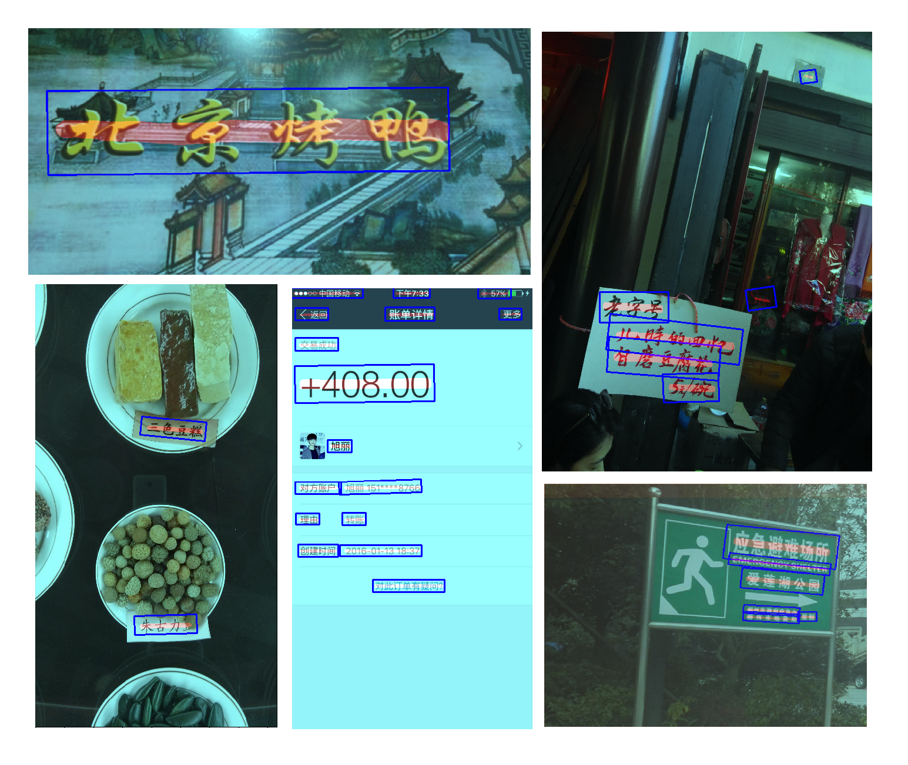

# STD++: A Semantic-based Arbitrarily-Oriented Scene Text Detector

This repository is the official implementation of `A Semantic-based Arbitrarily-Oriented Scene Text Detector`(named STD++ as it is the improved version of [STD](https://github.com/opconty/keras_std)).due to lack of computing resources and time, we tested STD++ on MTWI2018 dataset, and we hope to perform more experiments on any other benchmark datasets, such as IC15,IC17,COCO-Text,MSRA-TD500 and so on.


*images come from icdar2017rctw*

## Introduction

STD++ is the improved version of STD, which solved STD's limitations and can be used to detect arbitrarily-oriented texts, yet still preserves its accuracy and efficiency:

- no any further post-processings, like NMS.
- anchor-free.
- easy to generate training labels.
- only one step process to get final bounding boxes.

Any questions or suggestions,please drop a comment or contact me,email: gao.gzhou@gmail.com.

## Training

Download RCTW17 dataset below, and configure your local directory path. refer to [train.py](./train.py)

## Inference

[predict.py](./predict.py)

## Examples



## Dataset

We trained STD++ on MTWI2018 dataset, training and testing images can be downloaded from [this site](https://tianchi.aliyun.com/competition/entrance/231685/information) for Text Localization, and we make STD++ annotations available on [baiduyun, code: nuti](https://pan.baidu.com/s/16HgPa5Xy0I7vv4j8tGSmjQ).

## License

This project is released under the [Apache 2.0 license](https://www.apache.org/licenses/LICENSE-2.0).

## Citation

If you use our codebase in your research, please cite this project.
a paper or technical report will be released soon.

And besides, you are welcomed to join us to maintain this project.

```
@misc{std_plus_plus2019,
  author =       {Gao Lijun},
  title =        {STD++: A Semantic-based Arbitrarily-Oriented Scene Text Detector},
  howpublished = {\url{https://github.com/opconty/keras_std_plus_plus}},
  year =         {2019}
}
```
